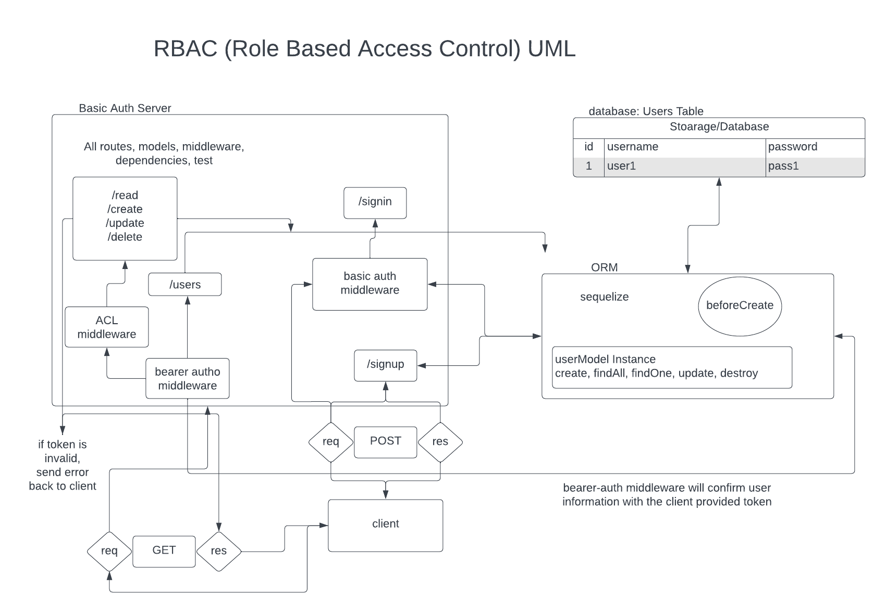

# LAB - 08

## Project: Auth-API

### Author: Kao Saelor

### Problem Domain

In this part of the Authentication Server project, we're adding Role Based Access Control (RBAC) using an Access Control List (ACL). This helps us control who can access what in a detailed way. We'll combine the auth-server and api-server into one to make sure only authorized users can use specific routes based on their permissions.

### Links and Resources

- [GitHub Actions ci/cd](https://github.com/CodingKao/auth-api/pulls?q=is%3Apr+is%3Aclosed)

- [back-end prod server url](https://auth-api-m7d7.onrender.com/)

### Collaborators

- Start code from Ryan Gallaway, Code Fellows Instructor
- Kenya Womack
- Hayden Cooper
- Coriana Williams

### Setup

#### `.env` requirements (where applicable)

Using only PORT which can be found on `.env.sample`

#### How to initialize/run your application (where applicable)

Clone repo, `npm i`, then run `nodemon` in the terminal

#### Routes

- GET : `/` - specific route to hit

#### Tests

To run tests, after running `npm i`, run the command `npm test`

#### Lab 8 UML

